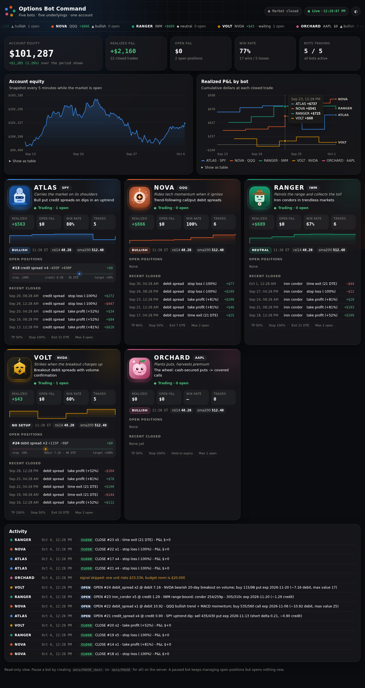

# Options bots: ATLAS · NOVA · RANGER · VOLT · ORCHARD

Five Python bots that trade US stock options on **Alpaca**, each on one underlying with
its own strategy, plus a live web dashboard. They run as systemd services on a VPS.
That means they're always running, restart on a crash or reboot, and trade only while
the options market is open (9:30–16:00 ET, Mon–Fri). The rest of the time they sleep.

| | Bot | Ticker | Strategy |
|---|---|---|---|
|  | **ATLAS** | SPY | Bull put credit spreads on dips in an uptrend |
|  | **NOVA** | QQQ | Trend-following call/put debit spreads |
|  | **RANGER** | IWM | Iron condors in trendless markets |
|  | **VOLT** | NVDA | Volume-confirmed breakout debit spreads |
|  | **ORCHARD** | AAPL | The wheel: cash-secured puts → covered calls |

Full rules: [STRATEGIES.md](STRATEGIES.md).

> **Paper trading by default.** Real money needs live keys *and*
> `ALPACA_LIVE=I-UNDERSTAND-THIS-IS-REAL-MONEY`. Options can lose money fast. Nothing
> here is financial advice, and none of these strategies is guaranteed to make money.
> Run it on paper for at least a few months first.

## What you need
1. An **Alpaca** account (free) at alpaca.markets. In the dashboard, switch to **Paper
   Trading** and generate API keys. Options are enabled on paper accounts. For live
   trading you need options approval **level 3** (spreads).
2. A VPS running Ubuntu 22.04+ or Debian 12 with Python 3.10+. 1 vCPU / 1 GB RAM is plenty.
3. Optional: a free Alpha Vantage key, for earnings dates (used by VOLT and ORCHARD).

## Install on the VPS
```bash
sudo apt update && sudo apt install -y git python3 python3-venv
git clone https://github.com/distortedjew/distortedjew.git
cd distortedjew/options-bots
sudo bash deploy/install.sh                 # -> /opt/options-bots + 6 systemd services
sudo nano /opt/options-bots/.env            # paste ALPACA_KEY_ID / ALPACA_SECRET_KEY
sudo systemctl restart 'optionbot@*' optionbots-dashboard
systemctl status 'optionbot@*'              # all five should be "active (running)"
journalctl -u optionbot@atlas -f            # watch one bot's log
```
To update later: `git pull && sudo bash deploy/install.sh && sudo systemctl restart 'optionbot@*' optionbots-dashboard`.
Your `.env` and trade history (`/opt/options-bots/data`) are kept.

## The dashboard


The dashboard shows account equity, realized P&L per bot, and a card per bot. Each
card has the bot's status, today's signal and indicator values, open positions with
live P&L, recent closed trades, win rate, and an activity feed. It refreshes every 15
seconds, works on a phone, and has dark and light themes. It is **read-only** and
holds no broker keys.

Click any bot (its name, avatar or "Full history, payoff & analytics") to open its **detail page**:
- profit factor, max drawdown, average win and loss, and average hold time
- cumulative P&L and a breakdown of how trades ended
- a **payoff-at-expiry diagram** for every open position, with breakevens, max profit and max loss
- the full trade history, filterable by wins and losses
- that bot's own activity log

- **Private (default):** it listens on `127.0.0.1:8080`. From your computer, run
  `ssh -L 8080:localhost:8080 you@your-vps`, then open http://localhost:8080.
- **Public:** set `DASHBOARD_PASSWORD` in `.env`, restart it, and open
  `http://your-vps-ip:8080`. You'll be asked to log in. Open the port with
  `sudo ufw allow 8080`. For HTTPS, put Caddy or nginx in front.

## Backtesting
Each bot's detail page has a **Backtest** panel, also reachable from the "Backtest →" link on
its card. Pick a period (1–8 years or custom dates) and your starting capital. You can change
any strategy setting (deltas, width, take profit, stop, DTE exit, max open, spacing), the risk
per trade and the pricing model, then press **Run**. You get:
- total return, CAGR, max drawdown, Sharpe, win rate and profit factor, all compared with
  buy & hold
- an equity curve against buy & hold of the underlying
- a monthly-returns heatmap
- a breakdown of exit reasons
- every trade, and the bot's day-by-day log
- a side-by-side table of all your runs this session, for comparing settings

How it works: it replays the underlying's **real daily prices** from Alpaca (using your keys
in `.env`; it only reads market data and never trades) through the bot's **actual code**: the
same signals, contract picking, sizing, risk checks and exits. Each day is checked twice, at
the open and at the close.

**Option prices are modelled, not historical:**
- Black-Scholes, with implied vol = 20-day realised vol × a premium, plus put skew
- a bid/ask spread, slippage and fees
- no earnings blackout

Real option prices, IV spikes and intraday gaps will differ, and stops are only checked
twice a day. Use the backtest to compare settings and catch bad rules, not to predict
profits.

Changes you make in the backtest panel **don't change the live bot**. To adopt a setting,
edit the class attributes at the top of `optionbots/bots/<name>.py` and restart that bot.

From the command line: `python -m optionbots.backtest atlas --years 5`. Without Alpaca keys
(or with `BROKER=sim`), it runs on random synthetic prices and says so clearly.

## Phone alerts (Telegram or Discord)
The bots message you when they open a trade (🟦), close a winner (✅) or a loser (🔻),
when a stop can't get filled, when the daily loss limit trips (⚠️), on errors (🛑), and
when ORCHARD gets assigned or called away. They also send one "online" message when they
start. An identical alert isn't repeated within `ALERT_DEDUPE_MIN` (30) minutes. Alerts
are sent in the background, so a chat outage never delays trading.

**Telegram:**
1. In Telegram, message **@BotFather**, send `/newbot`, and copy the token.
2. Send your new bot any message.
3. Open `https://api.telegram.org/bot<TOKEN>/getUpdates` and copy `"chat":{"id": ...}`.
4. In `.env`, set `TELEGRAM_BOT_TOKEN` and `TELEGRAM_CHAT_ID`.

**Discord:** go to Server settings → Integrations → Webhooks → New Webhook → Copy URL,
then set `DISCORD_WEBHOOK_URL` in `.env`.

Test it with `cd /opt/options-bots && sudo -u optionbots .venv/bin/python -m optionbots.notify`,
then restart the bots.

## Safety nets
- **Order-direction check.** After every fill, the bot re-reads its positions at Alpaca and
  checks that each leg went the intended way: legs it sold are short, legs it bought are
  long, and closing orders really closed. On any mismatch it creates its own
  `data/PAUSE_<bot>` file (no new trades), logs the details and sends a 🛑 alert. Check the
  account at Alpaca, fix it, then delete the PAUSE file.
- **Heartbeat watchdog.** The dashboard process watches all five bots around the clock and
  sends a 🛑 alert if one goes quiet for 10 minutes (crashed, stopped or hung). It repeats
  every 30 minutes while the bot is down, and sends a message when it's back.
- **Loud alert test.** `python -m optionbots.notify` prints `FAILED: ...` and exits with code
  1 if Telegram or Discord rejects the message.
- **Earnings check off.** VOLT and ORCHARD send a ⚠️ warning on startup if
  `ALPHAVANTAGE_API_KEY` is empty, because they can then hold a position through earnings.

## Control
- Pause one bot: `sudo -u optionbots touch /opt/options-bots/data/PAUSE_volt`. Pause
  all bots with `.../data/PAUSE`. A paused bot opens nothing new but still manages and
  exits open positions. Delete the file to resume.
- Stop a bot completely: `sudo systemctl stop optionbot@volt`. Its open positions are
  then **not** managed.
- Risk dials are in `.env`:
  - `BOT_ALLOCATION_PCT`: share of the account each bot may tie up (default 20%).
  - `RISK_PER_TRADE_PCT`: max loss of one spread (default 2%).
  - `MAX_CONTRACTS`: contract cap per trade.
  - `DAILY_MAX_LOSS_PCT`: when the account is down this much today, all bots stop
    opening trades.
- Strategy parameters (deltas, DTE, profit target, stop) are the class attributes at
  the top of each `optionbots/bots/<name>.py`.

## Try it with no keys
```bash
pip install -r requirements.txt
BROKER=sim python run_bot.py all            # five bots on a simulated market
python dashboard/server.py                  # http://127.0.0.1:8080
python -m unittest discover -s tests        # tests
```
The simulator only tests the plumbing. Its prices are random and its fills are generous.

## How it works
- `optionbots/base.py` is the shared engine. It handles the schedule, the risk checks
  (pause, daily loss limit, max open, spacing between trades), position sizing,
  choosing contracts by delta, DTE and liquidity, and exits (take profit, stop, time,
  plus each strategy's own exit). It also reconciles expired or assigned positions.
- `optionbots/execution.py` places multi-leg limit orders. It starts at the mid price
  and steps toward the market price if there's no fill; stop-outs step all the way to
  the market price.
- `optionbots/broker.py` is the Alpaca REST adapter: stock bars, the option chain with
  greeks, and multi-leg orders. `optionbots/simbroker.py` is the offline simulator.
- `optionbots/store.py` is the SQLite store: trades, events, heartbeats, equity. The
  bots write to it and the dashboard reads it.

## Before going live
- Leave it on paper long enough to see each bot through several trades. RANGER and
  ATLAS may trade only a few times a month.
- Check in Alpaca's paper dashboard that the first multi-leg orders filled as credit
  or debit the way the bot logged them.
- All five bots share one account. The allocation settings keep them from crowding
  each other out, but the worst case is still all five losing at once.
