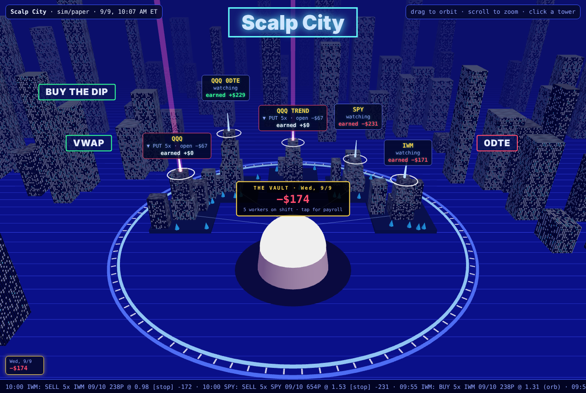
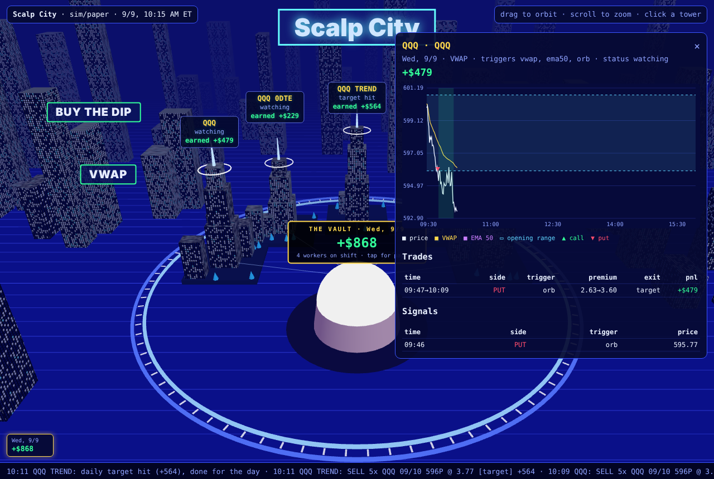

# Scalp City

A rebuild of the "Scalp City" options bots: Python bots that scalp 1-day-to-expiration options on QQQ, SPY and IWM
off a 1-minute chart. Each bot is a tower in a 3D city dashboard. **Paper trading only.**



## The strategy

What the original video describes, and how this code does it (`scalpcity/strategy.py`):

| Rule from the video | Implementation |
|---|---|
| Trades off a **one-minute chart** | Every decision happens when a 1-minute candle closes. |
| Trigger 1: a candle **closes across the VWAP** | Session VWAP from typical price × volume. It resets at 09:30 ET. |
| Trigger 2: a candle **closes across the 50 EMA** | 50-period EMA of 1-minute closes, carried over from the previous day. It doesn't trade until 50 bars have warmed it up. |
| Trigger 3: price **breaks out of the first 15 minutes' range** | High/low of the 09:30-09:44 candles. A breakout is a close outside the range after a close inside it. Each direction fires once per day by default. |
| Close **above** → buy a **call**. Close **below** → buy a **put**. | A cross means the previous close was on one side of the level and this close is on the other. If several triggers agree on the same candle, they merge into one signal (e.g. `ema50+vwap`). If they disagree, the bot stands aside. |
| Buys **one-day-to-expiration** options | `dte = 1` is the next trading day's expiry. It skips weekends and NYSE holidays. The strike is at the money (`otm_steps` moves it out). `dte = 0` trades same-day options. |
| **Stops trading for the day** once it's up a set amount | Each worker has a `daily_profit_target`. The city also has one (the "vault"). When the vault target hits, every bot closes out and clocks off. |

The video doesn't say how the bots **exit**. These rules are my defaults, and you can change all of them per worker:

- **Take profit** at +25% on the option premium and **stop loss** at -15%.
- **Opposite signal:** close the trade and flip to the other side (`exit_on_opposite`, `reverse_on_opposite`).
- **Time stop:** close after 30 minutes (`max_hold_min`).
- **Flatten** everything at 15:55 ET. The bots don't hold overnight, even with 1DTE options.
- **Limits:** a daily max loss per worker and for the city, a cap on trades per day, and a short cooldown after a stop or target.
- **Entry window:** new entries only between 09:31 and 15:30.

The workers in `config.example.toml` match the towers in the video:

| Worker | Triggers | Contract |
|---|---|---|
| `QQQ` | all three | 1DTE, at the money, 5 contracts |
| `QQQ 0DTE` | all three | same-day expiry |
| `QQQ TREND` | `ema50` + `orb` only (no VWAP chop) | longer leash |
| `SPY` | all three | 1DTE, at the money |
| `IWM` | all three | 1DTE, at the money |

## Run it

You need Python 3.11+. The core uses only the standard library.

```bash
cd scalp-city
python -m unittest discover -s tests            # 16 tests

# Backtest, then open the dashboard on the result
python -m scalpcity.backtest --synthetic 20     # no data or keys needed (random-walk market)
python -m scalpcity.dashboard.server            # http://127.0.0.1:8050

# Real history
export ALPACA_API_KEY_ID=... ALPACA_API_SECRET_KEY=...   # free paper keys work (IEX feed)
python -m scalpcity.backtest --source alpaca --start 2025-09-01 --end 2025-10-03
python -m scalpcity.backtest --csv QQQ=data/QQQ.csv --csv SPY=data/SPY.csv --csv IWM=data/IWM.csv
pip install yfinance && python -m scalpcity.backtest --source yfinance    # last ~7 days

# Live
python -m scalpcity.live --feed sim                       # fake market at 4 bars/s, so the dashboard moves
python -m scalpcity.live --feed alpaca                    # real 1-min bars, modelled option fills
python -m scalpcity.live --feed alpaca --broker alpaca    # real orders on your Alpaca PAPER account
```

Run the dashboard in a second terminal while the live bot runs. It polls `state.json` every 2 seconds.

- **Click a tower** to see that bot's chart for the day: price, VWAP, 50 EMA, the opening-range band, call/put signal arrows and shaded trades, plus its trade and signal tables.
- **Click the vault** for payroll (P&L per worker).
- **Click a day** in the bottom ribbon to replay it.
- **Beams:** a green beam means a call is open, a red beam means a put is open.



## Files

- `scalpcity/strategy.py`: the three triggers, computed incrementally, so the backtest and live bot run the same code.
- `scalpcity/worker.py`: one bot. It turns signals into option trades and handles exits and daily limits.
- `scalpcity/city.py`: routes bars to the workers, applies the vault limits, and writes the dashboard state.
- `scalpcity/options.py`: contract choice (1DTE, ATM, OCC symbols) and the Black-Scholes pricer for paper fills.
- `scalpcity/brokers/`: `paper.py` (modelled fills) and `alpaca.py` (Alpaca **paper** options orders; the URL is hard-coded to paper).
- `scalpcity/feeds.py`: bars from Alpaca, yfinance, CSV, or a synthetic market.
- `scalpcity/backtest.py` and `scalpcity/live.py`: the two runners.
- `scalpcity/dashboard/`: a stdlib HTTP server and the three.js city page (three.js loads from jsDelivr).

## Caveats

- **Backtest fills are a model.** Options are priced with Black-Scholes at a fixed IV per symbol (`[city] iv`), plus a spread and fees. Real short-dated option quotes, IV moves and slippage will differ. Before you trust any number, run the bots on an Alpaca paper account and compare real fills.
- **Synthetic results mean nothing.** The `--synthetic` market is a random walk for demos and tests, so its P&L says nothing about the strategy.
- **Untested against the real Alpaca API.** It was built without network access to Alpaca. The Alpaca adapter follows Alpaca's documented options API (`/v2/options/contracts`, `/v2/orders`, `/v1beta1/options/quotes/latest`), but its first run on a paper account is its first real test. Options trading must be enabled on that account.
- **Chop is the main risk.** VWAP crosses fire often in sideways markets. On the synthetic data, most losses came from `flip` exits on VWAP crosses. `min_cross_pct`, `cooldown_min`, or dropping `vwap` from `triggers` (as `QQQ TREND` does) reduce this.
- The original video's daily numbers ("almost $5,000 one Friday") are the creator's claim. Nothing here reproduces or verifies them.
